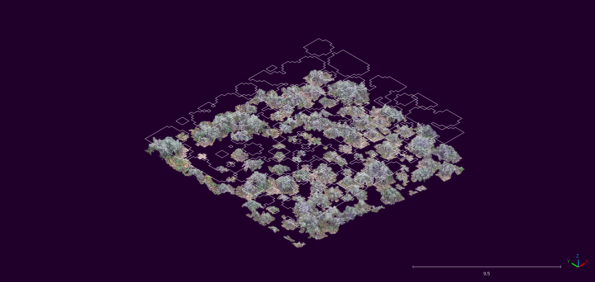

# Individual Shrub detection and shrub crown delineation using point cloud and Canopy Height Model (CHM) based algorithms.

* This sub-directory contains necessary code and materials for automated individual shrub detection using functions from the `lidR` and `ForestTools` R packages. 
* The code developed for this aspect of the project is an exploratory approach and thus is only applied to a subset of the study site. 
* Please refer to the manuscript for details about the project [URL FOR MANUSCRIPT]

**A detailed outline of the implementation of individual shurb detection algorithms including the generation of CHM raster from point cloud can be found:** 
* In the .pdf file [`PC_CHM_IndvShrubDetection.pdf`](PC_CHM_IndvShrubDetection.pdf) or in the .rmd file [`PC_CHM_IndvShrubDetection.Rmd`](PC_CHM_IndvShrubDetection.Rmd) in this subdirectory. 
* The [`PC_CHM_IndvShrubDetection.html`](PC_CHM_IndvShrubDetection.html) is an HTML version of the .pdf file that contains an additional feature where users can interact with the 3D point cloud.**  

  

<em>Isometric view of Variable Window Filter-based Individual Shrub Delineation (polyline) and Clipped Point Cloud Representing Individual Shrub Point Cloud.</em>
  

-----------------------------
**Code developed by:**  
Abhinav Shrestha  
Department of Earth and Spatial Sciences  
University of Idaho, Moscow, ID

Contact information: 
* abhinavs@uidaho.edu 
* [Academic website]( https://abhinavshrestha-41.github.io/)  
* [GitHub](https://github.com/abhinavshrestha-41)

 

**Principle Investigator:**  
Georgia R. Harrison  
Department of Plant Sciences  
University of Idaho, Moscow, ID  
gharrison@uidaho.edu

